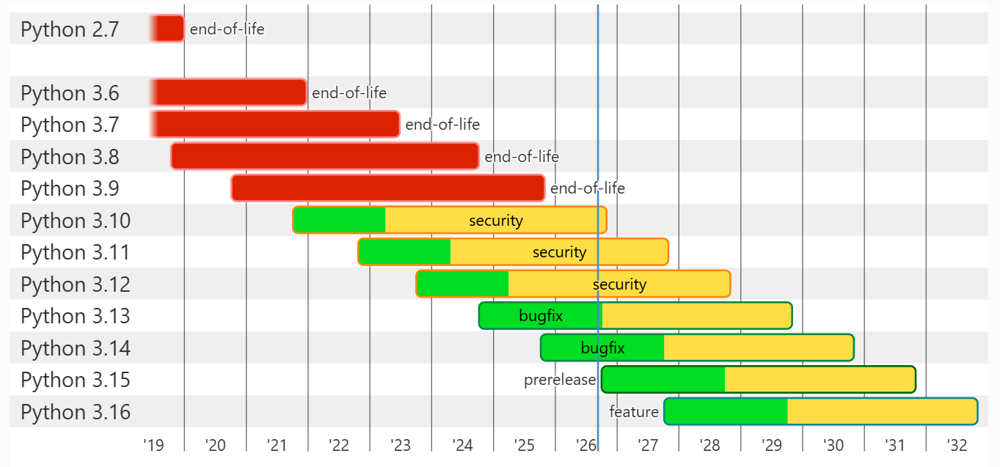
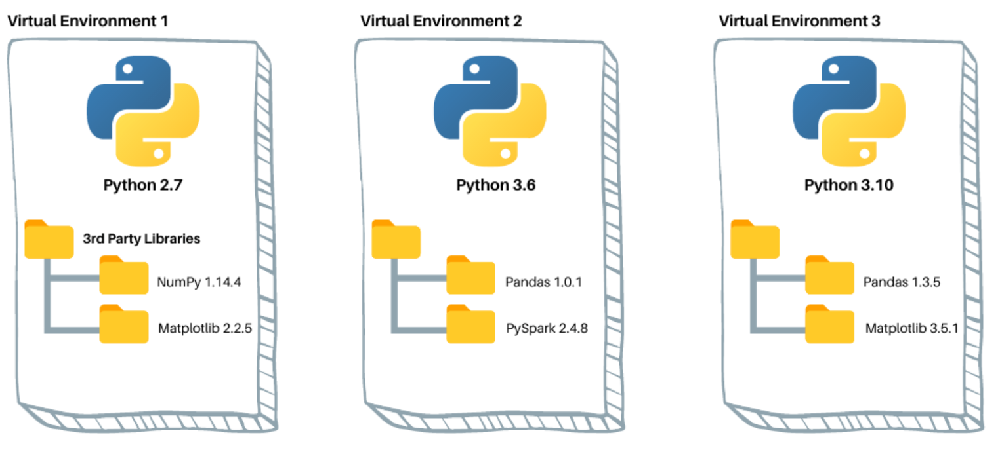

# Data Science and Machine Learning - CCUS
📝 Hands-on Tutorial

**Shuhua Wang, 2026**

---

# Shuhua Wang

Senior Data Engineer at <a  href="https://www.ovintiv.com/">Ovintiv</a>

- 🛢️ Petroleum Engineering <a href="https://www.ucalgary.ca/">@ UCalgary</a>
- 🖥️ Software Scientist <a href="https://www.cmgl.ca/">@ CMG</a>
- 💻 I often write at <a href="https://github.com/shuhua-wang">github.com/shuhua-wang</a>
- 📧 Email: shuhua.wang@ovintiv.com
- 🐍 Python, 📐 R

---

# Module 1
## Tooling & Environment Setup

Local Development 💻

- <a href="https://code.visualstudio.com/">Visual Studio Code</a>: code editor,
  integrated development environment (IDE)
- <a href="https://www.python.org/">Python</a>: programming language
- <a href="https://pypi.org/">PyPI</a>: Python package index, repository of
  software for the Python programming, helps you find and install software
  developed and shared by the Python community
- <a href="https://docs.astral.sh/uv/">uv</a>: an extremely fast Python package
  and project manager, setting up a **reproducible** Python environment
- <a href="https://github.com/">GitHub</a>: web-based platform for hosting and
  managing code repositories using `Git`, widely used by developers to collaborate
  on software projects, track changes, and manage version control

<a href="https://docs.github.com/en/billing/concepts/product-billing/github-codespaces">GitHub Codespaces 🚀</a>

- Cloud-based development environment feature that lets you spin up a fully
  configured, workspace directly from a GitHub repository, so you can write, run,
  and debug code in your browser without setting up anything locally

---

# Lessons in this module

1. What is a Terminal, and What is Python?
2. Installing `uv` (macOS, Linux, and Windows)
3. Managing Python Versions with `uv`
4. Managing Python Packages & Projects with `uv`
5. Setting Up an Editor and Jupyter

By the end: a working `uv` project, an editor, and Jupyter — ready for Module 2.

---
layout: center
---

# Lesson 1.1
## What is a Terminal, and What is Python?

---

# GUI vs. terminal

- **GUI** (Graphical User Interface) — click buttons and icons
- **Terminal** — type text commands, read text responses

Why use it?

- **Precise** — one line, no misclicks
- **Repeatable** — save & rerun the exact same steps
- **It's how Python, `uv`, and Jupyter actually work**

---

# Opening a terminal

| OS      | App (How to open it)                                                                        |
|---------|---------------------------------------------------------------------------------------------|
| Windows | **PowerShell** / **Command Prompt** (Search `powershell` or `cmd` in the search bar)          |
| macOS   | **Terminal** (Press `Command` + `Spacebar` to open Spotlight, type "terminal" → "Terminal") |

<br>

```text
PS C:\Users\yourname>            ← Windows powershell prompt

C:\Users\yourname>               ← Windows cmd prompt
```

```text
yourname@yourcomputer ~ %        ← macOS/Linux prompt
```

---

# Navigation commands

```bash
pwd        # where am I?
ls         # what's here?  (Windows: dir)
cd notebooks   # move into a folder
cd ..          # move up one level
cd ~           # jump to home
```

- **Absolute path**: `/Users/yourname/projects/...`
- **Relative path**: `notebooks` (from where you are now)
- Spaces in a name? Quote it: `cd "My Project"`
- macOS/Windows: case-*insensitive*. Linux: case-*sensitive*.

---

# What is Python?

- A programming language, designed to read like plain English
- Code lives in a **script**: a plain text `.py` file
- Python is **interpreted** — the **interpreter** reads and runs
  your code line by line (no separate compile step)

```bash
python hello.py
```

```text
Hello, world!
```

---
layout: center
---

# Lesson 1.2
## Installing `uv`

---

# What is `uv`, and why use it?

`uv` = one fast tool that installs Python versions, creates isolated project
environments, installs packages, and locks exact versions for Python & Python
packages.

Replaces juggling `pip` + `venv` + `pyenv` (+ `conda`) separately.

- **One tool**, one mental model
- **Fast** — 10–100x faster installs than `pip`
- **Reproducible** — writes a lockfile automatically
- **Never touches your system Python**

---

# Install <a href="https://docs.astral.sh/uv/">uv</a>: macOS / Linux

- Method 1:

```bash
curl -LsSf https://astral.sh/uv/install.sh | sh
```

```text
downloading uv 0.12.3 aarch64-apple-darwin
installing to /Users/yourname/.local/bin
everything's installed!
```

- Method 2:

macOS + Homebrew alternative: `brew install uv`

Close & reopen your terminal afterward.

---

# Install <a href="https://docs.astral.sh/uv/">uv</a>: Windows

- Method 1:

```powershell
powershell -ExecutionPolicy ByPass -c "irm https://astral.sh/uv/install.ps1 | iex"
```

```text
downloading uv 0.12.3 x86_64-pc-windows-msvc
installing to C:\Users\yourname\.local\bin
everything's installed!
```

- Method 2:

Alternative: `winget install --id=astral-sh.uv -e`

Close & reopen PowerShell afterward.

---

# Verify the install

```bash
uv --version

> uv 0.12.3 (aarch64-apple-darwin)
```

If you see **"command not found: uv"** (or PowerShell's "not recognized"), it's a
**PATH** problem — your shell doesn't know where `uv` lives.

---

# Fixing PATH issues

**What is PATH?** A list of folders your shell searches for commands.

- **macOS/Linux**: reopen terminal, or `source ~/.zshrc` (`~/.bashrc` on many
  Linux setups); confirm `~/.local/bin` is exported onto `PATH`

```text
export PATH=$HOME/.local/bin:$PATH
```

- **Windows**: reopen PowerShell; else Start Menu → "Environment Variables" →
  edit `Path` → add `...\​.local\bin`

---
layout: center
---

# Lesson 1.3
## Managing Python Versions with `uv`

---

# Why pin a <a href="https://www.python.org/downloads/">Python version</a>?

- Python changes over time (3.10, 3.11, 3.12, ...)
- Your code, or a package, may need a specific version
- **Pinning** records the exact version a project expects — so
  everyone (including future you) gets the same one automatically

Same reproducibility idea as the lockfile in Lesson 1.4, applied to Python itself.



---

# List & install versions

- List which python is installed on your computer

```bash
uv python list

> cpython-3.13.2-macos-aarch64-none   <download available>
> cpython-3.10.12-macos-aarch64-none  /Users/yourname/.local/bin/python3.10
```

- Install python

```bash
uv python install 3.14

> Installed Python 3.14.7 in 2.1s
```

> [!NOTE]
> - `uv` downloads and manages versions itself — no separate python.org install needed
> - Install multiple versions of Python on your computer at the same time
> - Manage different versions of Python on the same machine

---

# Pin a version to a project

```bash
uv python pin 3.14

> Pinned `.python-version` to `3.14`
```

This file is committed to version control — every collaborator gets the same
interpreter.

---

# Per-project switching

```bash
cd project-a   # pinned 3.10
uv run python --version    # → Python 3.10.12

cd project-b   # pinned 3.12
uv run python --version    # → Python 3.12.8
```

`uv` reads each folder's pin automatically, each project uses its own Python
version without conflicts.

---
layout: center
---

# Lesson 1.4
## Managing Python Packages & Projects with `uv`

---

# Packages & version conflicts

- A **package** = reusable published code (`pandas`, `scikit-learn`, ...) on PyPI
- Packages depend on other packages, which have their own versions
- **Version conflict**: two things you need disagree on a shared
  dependency's version

Fix: give every project its **own isolated environment** (`.venv`) —
`uv` creates and manages this for you.



---

# `uv init` — start a new project

```bash
mkdir my-first-project && cd my-first-project
uv init
```

```text
my-first-project/
├── .python-version  ← Python version
├── pyproject.toml   ← the project's "ID card"
├── README.md
└── main.py
```

---

# `uv add` — add a dependency

```bash
uv add pandas       # add pandas to the project
uv remove pandas    # remove pandas from the project
```

```text
Resolved 12 packages in 320ms
Installed 6 packages in 89ms
 + numpy==2.2.6
 + pandas==2.3.3
 ...
```

- Resolves compatible versions
- Installs into the project's isolated environment
- Updates `pyproject.toml` **and** `uv.lock`

---

# `uv run`, `uv venv` and `uv sync`

- `uv run` — "do this, using exactly this project's packages & Python"

```bash
uv run python main.py     # run inside the project's own environment
```

<br>

- `uv venv` — "create a virtual environemnt inside project folder"

```bash
uv venv .venv             # run inside the project's own environment
```

<br>

- `uv sync` = "make my environment match what's recorded, exactly"

```bash
uv sync                   # recreate the environment from
                          # pyproject.toml + uv.lock, exactly
```

---

# What is `uv.lock`, and why commit it?

- `pyproject.toml` says *what you want* (roughly — version ranges)
- `uv.lock` says *exactly what you got* — every package, exact version,
  down to the last patch number
- Commit it to version control (`git`) → everyone gets a
  **byte-for-byte identical environment**, forever

Never hand-edit `uv.lock` — change deps with `uv add` / `uv remove`.

---

# This repo already has an environment!

Everything above is the workflow for a **brand-new project of your own.**

For **this course's repo**, `pyproject.toml` + `uv.lock` already exist — just run:

```bash
cd data-science-and-machine-learning-courses
uv sync
```

That's the *only* command you need here. Then use `uv run ...` for everything.

---
layout: center
---

# Lesson 1.5
## Setting Up an Editor and Jupyter

---

# VS Code

1. Download from <a href="https://code.visualstudio.com/">Visual Studio Code</a>, install
2. Extensions panel → install **"Python"** (Microsoft)
3. Optional: `code .` opens the current folder in VS Code

Any editor works — VS Code is just the one with guided setup here.

---

# Adding Jupyter

```bash
uv add jupyter
```

```text
Resolved 38 packages in 210ms
Installed 38 packages in 3.4s
 + jupyter==1.1.1
 + ipykernel==7.3.0
```

`.ipynb` notebook = formatted text + live code + output, in runnable **cells**.

---

# Launching a notebook

```bash
uv run jupyter lab
```
```text
Jupyter Server is running at:
http://localhost:8888/lab?token=8f2e1c9a...
```

Or: install the **"Jupyter"** extension in VS Code and open any `.ipynb` directly.

Pick the kernel pointing at this project's `.venv` — that's what guarantees the
right packages.

---

# You're ready

- `Shift+Enter` runs a cell and moves to the next
- "Run All Cells" runs a whole notebook top to bottom
- `ModuleNotFoundError` on something installed? → wrong kernel selected

---
layout: center
---

# Module 1 complete

Terminal ✓ · `uv` ✓ · Python versions ✓ · Project & packages ✓ · Editor & Jupyter ✓

On to **Module 2: Python Programming Basics**
